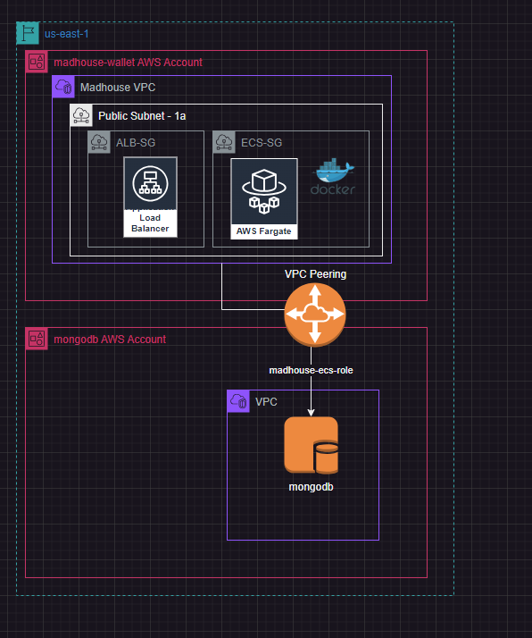

# madhouse-cdk-deploy

This code deploys the alb and the ecs fargate instances below. It also deploys appropriate roles and permissions. The containers used is referenced in the docker folder. The only thing needed is to build a docker file that will deploy the code.

You will also need to move the logic for database into the container. the role is set up with appropriate permissions to access the database.

To deploy cdk first get access/secret key from account,

1. clone repository
2. cd fargate-with-alb
3. npm install
4. npm run build //builds project and checks for changes in docker file.
5. cdk diff //explains what will be deployed 
6. cdk deploy // deploys cdk code.

Please make a seperate stack for deploying to staging than deploying to production. 

Currently the endpoint for the alb is here (this is where the website will be hosted): http://madhou-farga-bhuxiphuivog-1554526068.us-east-1.elb.amazonaws.com/

